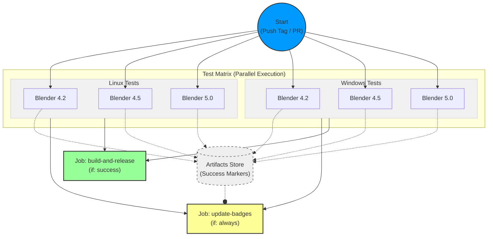

## CI/CD Process

```mermaid
graph TD
    Start(("Start<br>(Push Tag / PR)"))

    subgraph TestMatrix ["Test Matrix (Parallel Execution)"]
        direction LR
        subgraph Linux ["Linux Tests"]
            direction TB
            L_42["Blender 4.2"]
            L_45["Blender 4.5"]
            L_50["Blender 5.0"]
        end
        subgraph Windows ["Windows Tests"]
            direction TB
            W_42["Blender 4.2"]
            W_45["Blender 4.5"]
            W_50["Blender 5.0"]
        end
    end

    Artifacts[("Artifacts Store<br>(Success Markers)")]

    UpdateBadges["Job: update-badges<br>(if: always)"]
    Release["Job: build-and-release<br>(if: success)"]

    Start --> L_42 & L_45 & L_50 & W_42 & W_45 & W_50

    L_42 & L_45 & L_50 & W_42 & W_45 & W_50 -.-> Artifacts

    Linux & Windows --> UpdateBadges
    Linux & Windows --> Release

    Artifacts -.-o UpdateBadges

    classDef trigger fill:#09f,stroke:#333,stroke-width:2px;
    classDef job fill:#ff9,stroke:#333,stroke-width:2px;
    classDef release fill:#9f9,stroke:#333,stroke-width:2px;
    classDef data fill:#eee,stroke:#333,stroke-dasharray: 5 5;

    class Start trigger;
    class UpdateBadges job;
    class Release release;
    class Artifacts data;

    style Linux fill:#f0f0f0,stroke:#ccc
    style Windows fill:#f0f0f0,stroke:#ccc
```