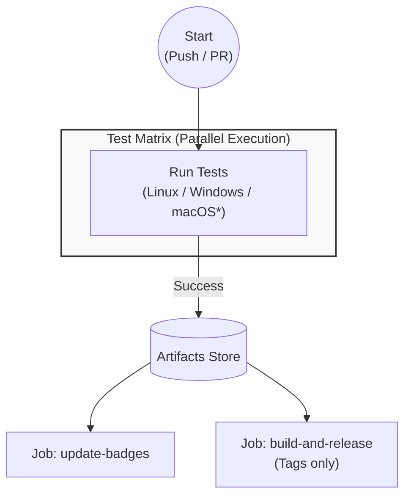

## Automated Code Review

This project utilizes **CodeRabbit AI** to assist with code reviews. Its purpose is to catch potential bugs and suggest improvements early in the process.

However, AI suggestions should be treated as **optional advice**, not mandatory requirements.
* If the AI makes a mistake or gives a false positive, please disregard it or explain why in the comments.
* **Final decisions are always made by human reviewers.** Do not feel pressured to implement every suggestion made by the bot.

## Testing

This repository includes end-to-end (E2E) tests to verify the add-on in a headless Blender environment. We use [blup](https://github.com/unclepomedev/blup) to manage Blender versions and execution.

### Prerequisites

1. Just: [Installation Guide](https://github.com/casey/just)
2. blup: [Installation Guide](https://github.com/unclepomedev/blup)

### Running Tests

To run the tests, use the `just` command. It will automatically detect the Blender executable via `blup`.

```shell
# Run tests with the default version (defined in .blender-version or global default)
just test-blender

# Run tests with a specific version
just test-blender 4.2.0
```

### CI Environment

Tests are automatically executed on Windows and Linux (plus macOS for daily builds) via GitHub Actions. We use [setup-blup](https://github.com/unclepomedev/setup-blup) to efficiently cache and setup the test environment across different OSs.



